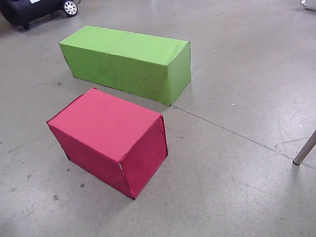
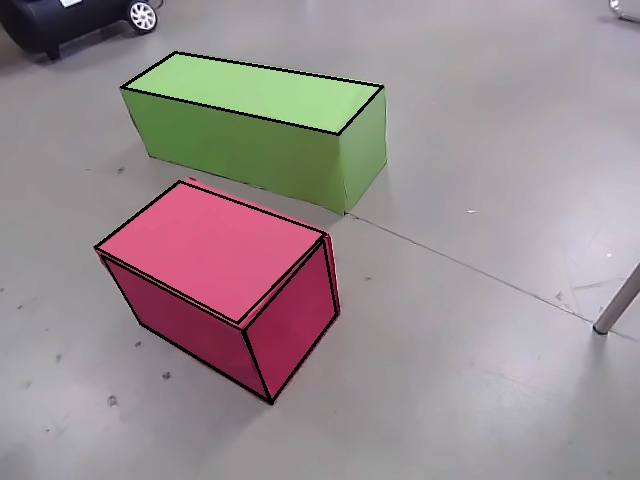

# box_detect
方块检测

### 方案一

### 方案二

<!-- #  -->

## 　流程
获得一张图片->
	去噪（单张图片fastNlMeansDenoisingColored）->
	获取边缘（Canny）->　获得点
	存入一张空白图片中　->
	对该图片进行形态学处理（模糊锋利边缘特征）->
	在该图中重新findContours　->
	逼近封闭多边形（approxPolyDP）->
	边为４的多边形的点  ->
		获取以该点为中心的2dd长的正方形，通过Shi_Tomasi获得该区域角点 ->
		优化角点与原多边形点趋近于原多边形顶点　->
		SolvePNP获得旋转矩阵与平移矩阵
	取包括四个点的矩形区域，获得该块直方图，获得该区域像素 ->
	对比像素与基础ＲＧＢ三色距离，距离最小为对应颜色　->
	通过获得的颜色与旋转矩阵与平移矩阵初始化Box类　->
	Box类冲突计算，选取唯一Box
	存入任务列表中

## 

